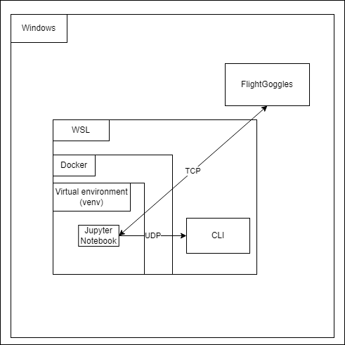

# 📃 Description
<div style="text-align: justify"> 
This repository showcases a project developed for the <b>Programming Principles of Mobile Robotics</b> course at TU-Wien during the 2022/23 academic year. The objective of this project was to integrate the <b>API</b> of the <b>Tello Drone</b> [4] into a simulator environment. To achieve this goal, we utilized FlightGoggles [1], a simulator backend created by MIT.
</div>

# 🏠 Architecture
<div style="text-align: justify">

</div>


# 💾 Iinstallation
## In your WSL 
<div style="text-align: justify">
</div>

```
git clone https://github.com/hofslu/ppmrob.git
```
```
docker build -t mygogglestoo .
```
## On Windows
<div style="text-align: justify">
download the prebuild simulator backend from [3].
</div>

# 🔧 Usage
## On Windows
Start the <b>FlightGogglesv3-release-windows/FlightGoggles.exe</b>, you sould see a ready to receive screen.

## In your WSL 
```
cd /PATH-TO-PROJECT/pyFlightGoggles
```
```
./run_docker.sh
```

you should now see jupyter running, use the last link to navigate to the notebooks:
```
    To access the notebook, open this file in a browser:
        file:///root/.local/share/jupyter/runtime/nbserver-1-open.html
    Or copy and paste one of these URLs:
        http://<PC-NAME>:8888/?token=9deebd8afbb9669dbfac9de0b4fdaff57af93390f9c0643a
     or http://127.0.0.1:8888/?token=9deebd8afbb9669dbfac9de0b4fdaff57af93390f9c0643a
```
⚠ **The Simulator should be running before you run the actual notebook** ⚠

Run the <b>ENTRY_uav.ipynb</b> notebook, you should now see a live video of your drone simulation.

⚠ **You must run the jupyter notebook before the sender_script** ⚠

Ensure you are in the project folder
```
cd /PATH-TO-PROJECT
```
```
python3 sender_srcipt.py
```
send commands and watch the drone fly around :)

# 👨‍💻 Tuning
You can add various functioanlities under the **SDK commands** section in the jupyter notebook <b>ENTRY_uav.ipynb</b>. [5]

To make commands receivable, map your custom command to your desired function in the **command_map** under *API-Maping*. 

Happy coding :)

# 🗄 References
 [1] FlightGoggglesDocumentation - https://flightgoggles-documentation.scrollhelp.site/fg/index.html<br>
 [2] pyFlightGoggles - https://github.com/mit-aera/pyFlightGoggles<br>
 [3] PreBuildBackend - https://drive.google.com/file/d/1p25a5tzhxBoewxsJ2y_SHD2F5E_hS8QJ/view<br>
 [4] TelloDrone - https://www.ryzerobotics.com/de/tello-edu<br>
 [5] TelloSDKUserGuide - https://dl-cdn.ryzerobotics.com/downloads/Tello/Tello%20SDK%202.0%20User%20Guide.pdf<br>
